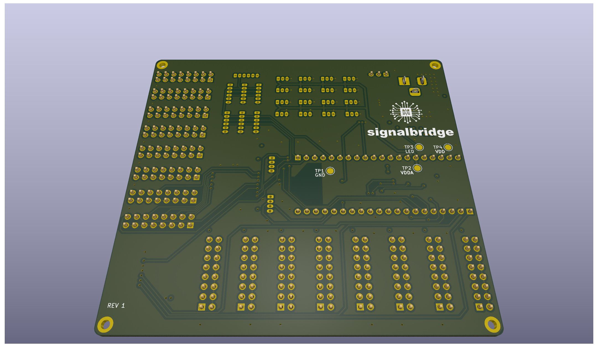

<!-- markdownlint-disable MD033 MD041 -->

<!-- markdownlint-enable MD033 MD041 -->

# Signalbridge - Board

**A comprehensive, industrial-grade breakout board for the Raspberry Pi Pico with advanced I/O expansion and control capabilities.**

## 🚀 Overview

Signalbridge is a feature-rich breakout board designed to unlock the full potential of the Raspberry Pi Pico microcontroller. This board transforms the Pico into a powerful controller suitable for industrial automation, IoT projects, robotics, and educational applications.

> [!TIP]
> This board is designed for the Raspberry Pi Pico.

Related repos:

- [Signalbridge breakout board](https://github.com/carlosmazzei/signalbridge-board) (This repo)
- [Signalbridge test suite](https://github.com/carlosmazzei/signalbridge-test-suite)
- [Signalbridge firmware](https://github.com/carlosmazzei/signalbridge-controller)

### Key Highlights

- **Wide Input Voltage Range**: 4.2V to 18V DC input with efficient 3.3V/3A regulation
- **16-Channel Analog Inputs**: Expandable analog reading capability through integrated multiplexer
- **8×8 Keypad Matrix**: Professional keypad interface with ESD protection
- **Multiple Communication Interfaces**: I2C, UART, and 8 SPI outputs
- **LED Display Controller**: TM1639 for driving 7-segment displays and LED matrices
- **PWM Output**: Dedicated PWM output with 3-pin connector
- **User LED**: Power-on indicator LED
- **Mounting**: 4× mounting holes for secure installation
- **Comprehensive Protection**: ESD protection on all external interfaces
- **Professional Grade**: Designed for reliability and expandability

## ✨ Features

### 🔌 Power Management

- **Input Voltage**: 4.2V to 18V DC (via barrel jack connector)
- **Regulation**: AP62300TWU buck converter providing 3.3V at up to 3A
- **Efficiency**: High-efficiency switching regulator with low dropout
- **Protection**: Input protection and power indicator LED
- **Flexibility**: Can be powered via USB or external DC supply

### 📊 Analog Inputs (16-Channel)

- **Multiplexer**: CD74HC4067 16:1 analog multiplexer
- **Resolution**: 12-bit ADC resolution (0-4095 digital values)
- **Voltage Range**: 0V to 3.3V analog input range
- **Reference**: Precision LM4040DBZ-3 3.0V voltage reference for accuracy
- **Software Control**: Channel selection via GPIO control lines
- **Connectors**: 16× 3-pin screw terminals for easy field wiring

### ⌨️ Keypad Matrix Interface (8×8)

- **Matrix Size**: 8 rows × 8 columns (64 keys maximum)
- **Connectors**: 2× 16-pin IDC headers for row/column connections
- **Protection**: BAT54J Schottky diodes on every line for ESD protection
- **Pull-ups**: Integrated pull-up resistors for reliable scanning
- **Flexibility**: Supports various keypad sizes up to 8×8

### 🔗 Communication Interfaces

#### I2C Interface

- **Pins**: SDA (GPIO2), SCL (GPIO3)
- **Pull-ups**: 2.2kΩ pull-up resistors to 3.3V
- **Connector**: 4-pin terminal block (VCC, GND, SDA, SCL)
- **Voltage**: 3.3V logic levels

#### UART Interface  

- **Pins**: TX (GPIO0), RX (GPIO1)
- **Connector**: 4-pin terminal block (VCC, GND, TX, RX)
- **Voltage**: 3.3V logic levels
- **Usage**: Serial communication, debugging, or external device control

#### SPI Interfaces (8 Outputs)

- **Outputs**: 8× independent SPI chip select lines
- **Connectors**: 6-pin headers per SPI output
- **Pinout**: VCC, GND, MOSI, MISO, SCLK, CS
- **Shared Bus**: Common MOSI, MISO, SCLK with individual chip selects
- **Applications**: Multiple SPI devices, sensor networks, display modules

### 🖥️ Display Controller

- **IC**: TM1639 LED display controller
- **Interface**: 3-wire serial (DIO, CLK, STB)
- **Capability**: Drive 8×8 LED matrix or multiple 7-segment displays
- **Features**: Built-in key scanning, adjustable brightness, minimal GPIO usage
- **Connector**: 6-pin header with standard TM1639 pinout

### 🎛️ Additional I/O

- **PWM Output**: Dedicated PWM output with 3-pin connector
- **Test Points**: Multiple test points for debugging and measurement
- **User LED**: Power-on indicator LED
- **Mounting**: 4× mounting holes for secure installation

## 📋 Technical Specifications

### Electrical Characteristics

| Parameter             | Min | Typ | Max  | Unit |
| --------------------- | --- | --- | ---- | ---- |
| Input Voltage         | 4.2 | 9.0 | 18.0 | V    |
| Output Voltage        | -   | 3.3 | -    | V    |
| Output Current        | -   | -   | 3.0  | A    |
| ADC Resolution        | -   | 12  | -    | bits |
| ADC Reference         | -   | 3.0 | -    | V    |
| Operating Temperature | -20 | 25  | 85   | °C   |

### Physical Dimensions

- **PCB Size**: 99.7 × 99.1 mm
- **Mounting Holes**: 4× M3 holes
- **Connector Types**: Screw terminals, pin headers, IDC connectors
- **Layer Count**: 4-layer PCB design

## 🔧 Hardware Setup

### 1. Power Connection

- DC Input: Connect 4.2V to 18V DC to J2 barrel connector
- USB Power: Connect USB cable to Raspberry Pi Pico (alternative)

### 2. Analog Inputs (AN1-AN16)

- Signal Range: 0V to 3.3V maximum
- Connector: 3-pin screw terminals
- Pinout: Signal, VDDA, GND

### 3. Keypad Matrix

- Row Connector (JR1-JR8): Connect keypad rows 1-8
- Column Connector: Connect keypad columns 1-8
- Matrix Size: Up to 8×8 (64 keys)

### 4. Communication Interfaces

- I2C (J30): VCC(3.3V), GND, SDA, SCL
- UART (J31): VCC(3.3V), GND, TX, RX  
- SPI (JSPI1-JSPI7): VCC, GND, MOSI, MISO, SCLK, CS

## 🔨 Assembly Instructions

### Required Components

- 1× Raspberry Pi Pico (with headers soldered)
- 1× Signalbridge PCB
- Connectors (screw terminals, pin headers as needed)
- Power supply (4.2V to 18V DC)

### Assembly Steps

1. **Inspect PCB**: Check for any manufacturing defects
2. **Install Raspberry Pi Pico**: Insert Pico into main socket (U4 position)
3. **Connect Power**: Wire DC supply to J2 barrel connector
4. **Test Power**: Verify 3.3V output and LED indicator
5. **Install Connectors**: Solder required connectors for your application
6. **Test Interfaces**: Verify I2C, SPI, and ADC functionality

### Troubleshooting

- **No Power LED**: Check input voltage and connections
- **ADC Readings Incorrect**: Verify voltage reference and input range
- **I2C Not Working**: Check pull-up resistors and wiring
- **Keypad Issues**: Verify matrix connections and ESD protection

## 🔧 Pin Assignments

### Raspberry Pi Pico Pin Usage

| GPIO  | Function  | Description               |
| ----- | --------- | ------------------------- |
| 0     | UART0_TX  | UART transmit             |
| 1     | UART0_RX  | UART receive              |
| 2     | SDA       | I2C data line             |
| 3     | SCL       | I2C clock line            |
| 4-9   | ROW1-ROW6 | Keypad matrix rows        |
| 10    | ADC_MUX_A | ADC multiplexer control A |
| 11    | ADC_MUX_B | ADC multiplexer control B |
| 12    | ADC_MUX_C | ADC multiplexer control C |
| 13    | ADC_MUX_D | ADC multiplexer control D |
| 14-21 | COL1-COL8 | Keypad matrix columns     |
| 22    | PWM_OUT   | PWM output                |
| 26    | ADC0      | Multiplexed analog input  |
| 27    | CS_LED    | TM1639 strobe             |
| 28    | CS_KEY    | TM1639 data I/O           |

### SPI Chip Select Assignments

| Signal | GPIO   | Description  |
| ------ | ------ | ------------ |
| CS1    | GPIO5  | SPI device 1 |
| CS2    | GPIO6  | SPI device 2 |
| CS3    | GPIO7  | SPI device 3 |
| CS4    | GPIO8  | SPI device 4 |
| CS5    | GPIO9  | SPI device 5 |
| CS6    | GPIO16 | SPI device 6 |
| CS7    | GPIO17 | SPI device 7 |
| CS8    | GPIO18 | SPI device 8 |

### Shared SPI Signals

| Signal | GPIO   | Description              |
| ------ | ------ | ------------------------ |
| MOSI   | GPIO19 | SPI Master Out, Slave In |
| MISO   | GPIO20 | SPI Master In, Slave Out |
| SCLK   | GPIO21 | SPI Clock                |

## 🛡️ Safety and Compliance

### Electrical Safety

- Input voltage: 4.2V to 18V DC only
- Maximum current: 3A output
- ESD protection: BAT54J diodes on all external interfaces
- Reverse polarity: Protected by input diode

### Usage Guidelines

- Do not exceed maximum input voltage (18V)
- Ensure proper grounding for all analog measurements
- Use appropriate wire gauge for current requirements
- Follow proper ESD handling procedures

## 📄 License

This project is released under the [**MIT License**](LICENSE).

## 🤝 Contributing

We welcome contributions to improve Signalbridge! Here's how you can help:

### Hardware Improvements

- PCB layout optimizations
- Additional connector options
- Component substitutions for better availability
- Cost reduction improvements

### Software Development

- Additional driver libraries
- Example projects
- Documentation improvements
- Bug fixes and optimizations

### How to Contribute

1. Fork the repository
2. Create a feature branch (`git checkout -b feature/amazing-feature`)
3. Commit your changes (`git commit -m 'Add amazing feature'`)
4. Push to the branch (`git push origin feature/amazing-feature`)
5. Open a Pull Request

### Issue Reporting

Please use GitHub Issues to report:

- Hardware design problems
- Software bugs
- Documentation errors
- Feature requests

## 📞 Support

### Community Support

- **GitHub Issues**: Report bugs and request features
- **Discussions**: General questions and project sharing
- **Wiki**: Community-maintained documentation

### Documentation

- **Schematic**: Detailed circuit diagrams
- **PCB Layout**: Layer stackup and routing
- **Assembly Guide**: Step-by-step assembly instructions
- **User Manual**: Comprehensive usage guide

## 🏆 Acknowledgments

- **Raspberry Pi Foundation** for the excellent Pico microcontroller
- **KiCad Development Team** for the outstanding PCB design tools
- **Open Source Community** for inspiration and shared knowledge
- **Component Manufacturers** for detailed datasheets and application notes

## 📈 Roadmap

### Version 2.0 Features (Planned)

- [ ] USB-C connector option
- [ ] CAN bus interface

### Long-term Goals

- [ ] Industrial enclosure design
- [ ] DIN rail mounting option
- [ ] Higher current power supply (5A)
- [ ] Isolated I/O options
- [ ] Professional certification (CE, FCC)

---

Made with ❤️ for the maker community

Signalbridge - Expanding the possibilities of Raspberry Pi Pico
